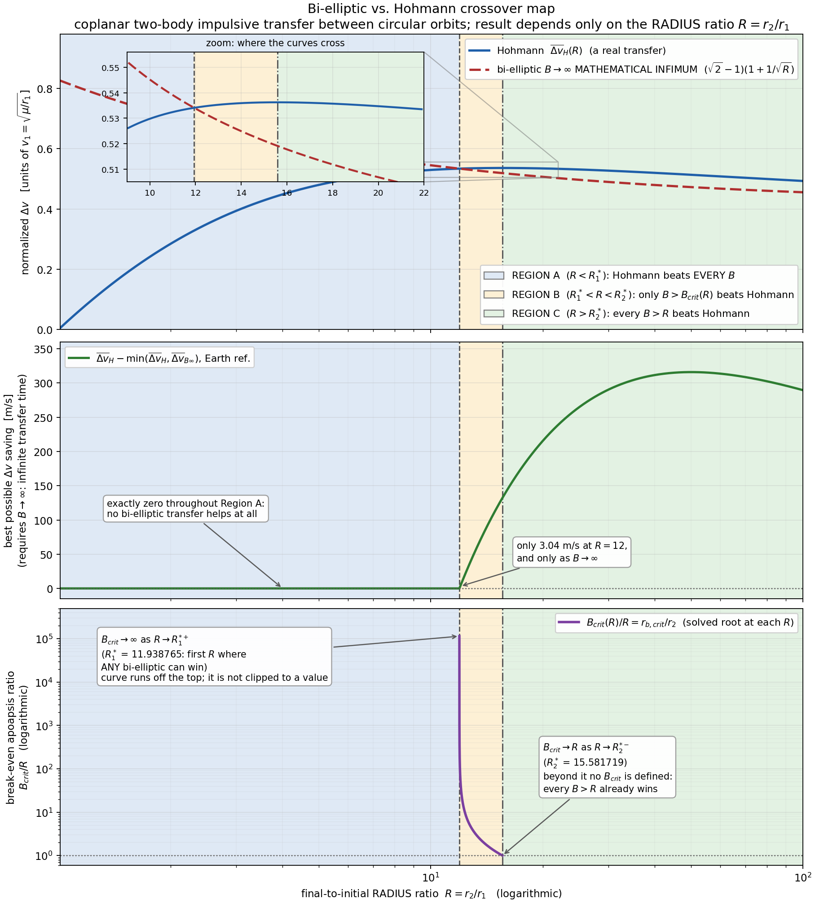
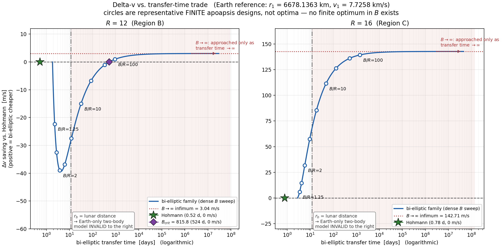
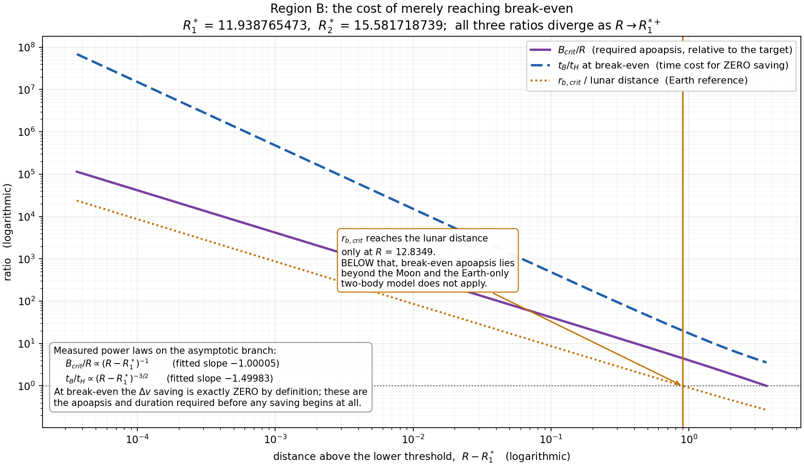

# Bi-elliptic / Hohmann Crossover

[](https://github.com/Sanjanakamboj/bielliptic-hohmann-crossover/actions/workflows/tests.yml)
[](LICENSE)

## Engineering question

**When does a bi-elliptic transfer actually beat a Hohmann transfer — and when is
that theoretical Δv advantage practically meaningless?**

Raising a spacecraft from one circular orbit to a higher one, the textbook answer
is "bi-elliptic wins above a radius ratio of about 12." That answer is incomplete
in two ways this project quantifies: there are **two** distinct thresholds, not
one, and the Δv advantage is frequently worthless once transfer time and
model validity are accounted for.

Idealized model: coplanar, two-body, impulsive burns. See [Limitations](#limitations).

## Headline result

```
R1* = 11.938765472645892      R2* = 15.581718738763179
```

with `R = r2/r1` the final-to-initial **radius** ratio and `B = rb/r1` the
intermediate apoapsis ratio.

| Region | Range | What it means |
|---|---|---|
| **A** | `R < 11.9388` | Hohmann beats **every** admissible bi-elliptic transfer. No apoapsis helps. |
| **B** | `11.9388 < R < 15.5817` | Bi-elliptic wins **only** if `B > B_crit(R)`. Near the lower edge, `B_crit` is astronomically large. |
| **C** | `R > 15.5817` | **Every** `B > R` wins on Δv — but the win can be worth almost nothing. |

Two further facts that the two-threshold picture alone does not convey:

- **`B → ∞` is a mathematical infimum, not a design.** The best achievable Δv is
  always an endpoint value, `min(dvH, dvB_inf)`, and the `B → ∞` endpoint costs
  unbounded transfer time. There is **no finite interior optimum** in `B`.
- **Transfer time can erase the benefit entirely.** At `R = 12` the entire
  theoretical prize is 3.04 m/s, and merely breaking even costs 1006× the
  Hohmann transfer time.



## Why there are two crossover numbers

They answer different questions, and are computed from **opposite ends** of the
`B` domain:

| | `R1*` = 11.9388 | `R2*` = 15.5817 |
|---|---|---|
| Condition | `dvH(R) = dvB_inf(R)` | `∂dvB/∂B = 0` at `B = R+` |
| Endpoint examined | `B → ∞` | `B → R+` |
| Exact form | `u³ − (1+2√2)u² + u + 1 = 0`, `u = √R` | `R³ − 15R² − 9R − 1 = 0` |
| Question | Can **any** bi-elliptic beat Hohmann? | Do **all** of them? |
| Quantifier | **∃** `B` | **∀** `B` |

**`R1*` is where the bi-elliptic family first contains a winner; `R2*` is where it
contains nothing but winners.** Between them, only sufficiently distant apoapses win.

## Practical trade



**`R = 12` (Region B) — a theoretical win that is practically useless.**
The entire mathematical prize is **+3.04 m/s**. A moderate apoapsis is actively
*worse* than Hohmann (−39.0 m/s at `B/R = 2`). Break-even needs `B_crit = 815.82`,
an apoapsis of 5.45 million km — **14.2 lunar distances** — for **1006×** the
Hohmann transfer time and zero saving. Even at `2·B_crit` the saving is 1.50 m/s
for a **2829×** time penalty. A 3 m/s saving sits inside the noise of launch
dispersion, navigation and finite-burn losses.

**`R = 16` (Region C) — a benefit that appears far more readily.**
Every `B > R` wins. `B/R = 2` saves **+31.9 m/s** at 7.45× the transfer time;
`B/R = 5` saves +85.4 m/s at 23.8×. The mathematical infimum is +142.7 m/s.

**But "every B wins" is a statement about sign, not magnitude.** Just above `R2*`,
a `B = 1.001R` transfer saves **0.0005 m/s** while taking 3.58× as long.

## Model-validity warning

Whenever the intermediate apoapsis approaches the **lunar distance (384 400 km)**,
an Earth-only two-body model stops being physically appropriate; beyond the Earth
Hill radius (~1.5×10⁶ km) the spacecraft is not meaningfully Earth-bound at all.
Every result table and both trade figures carry this flag.

Solving `r_b,crit` = lunar distance gives **`R = 12.834879147`**: below that — the
lower quarter of Region B — **the break-even apoapsis lies beyond the Moon**.
Numbers quoted there are mathematical extrapolations of an idealized model, not
trajectory designs.



## Earth example

Initial orbit 300 km altitude: `r1 = 6678.1363 km`, `v1 = 7.72576063698292 km/s`.
Final **altitude** is a conversion from the universal **radius-ratio** result.
`B/R = 2` is an arbitrary bounded design, **not** an optimum.

| case | `R` | region | Hohmann Δv [km/s] | `B→∞` infimum [km/s] | math. saving | `B/R` | finite-`B` saving | `t_B/t_H` | model |
|---|---|---|---|---|---|---|---|---|---|
| GEO | 6.3137 | A | 3.8926 | 4.4737 | +0.00 m/s | 2 | -316.96 m/s | 6.71 | caution |
| R=10 | 10.0000 | A | 4.0930 | 4.2121 | +0.00 m/s | 2 | -99.14 m/s | 7.14 | caution |
| R=12 | 12.0000 | B | 4.1269 | 4.1239 | +3.04 m/s | 2 | -39.02 m/s | 7.28 | caution |
| R=13 | 13.0000 | B | 4.1355 | 4.0877 | +47.87 m/s | 2 | -16.56 m/s | 7.33 | caution |
| R=15 | 15.0000 | B | 4.1427 | 4.0264 | +116.31 m/s | 2 | +18.24 m/s | 7.41 | caution |
| R=16 | 16.0000 | C | 4.1429 | 4.0001 | +142.71 m/s | 2 | +31.87 m/s | 7.45 | caution |
| R=20 | 20.0000 | C | 4.1312 | 3.9157 | +215.52 m/s | 2 | +70.31 m/s | 7.56 | caution |
| R=50 | 50.0000 | C | 3.9687 | 3.6527 | +316.01 m/s | 2 | +131.69 m/s | 7.83 | INVALID |

Generated by `scripts/m4_final_summary.py`; full detail in
[results/m4_final_summary.md](results/m4_final_summary.md).

**A 300 km LEO → GEO transfer is `R = 6.3137` — firmly Region A.** For the most
commonly flown high-orbit transfer, Hohmann is preferred within this model, and a
representative bi-elliptic costs *317 m/s more*. The largest instructive saving in
the studied range is **≈ 316 m/s near `R ≈ 50`** — and even that requires `B → ∞`.

## Verification

**1079 tests** pass under `pytest -W error` with no warnings. `ruff` and `pyflakes`
are clean.

- **Independent dimensional path.** Every normalized closed form is cross-checked
  against a direct vis-viva computation that shares no algebra with it; agreement
  to ~1e-16 relative across μ ∈ [1e2, 1e20] and r1 ∈ [1e1, 1e12].
- **Two independent solvers per threshold.** Root-finding on the transfer
  equations *and* the exact polynomial characterization, agreeing to ~1e-14.
  No crossover constant is hardcoded — a test asserts `constants.py` contains none.
- **Complex-step derivative check** on the analytical `∂/∂B`, sharing none of the
  hand algebra.
- **Structural scan.** Dense sweeps over `R ∈ [1.5, 200]` confirm **zero** interior
  local minima; every interior turning point is a maximum.
- **Cancellation-resistant formulation.** Burn 3 uses `sqrt(1+x)−1 = x/(√(1+x)+1)`;
  the naive form returns a *negative* burn magnitude at `B = R` for 58 of 398
  sampled `R`.
- **Deterministic artifacts.** All CSV/JSON regenerate byte-identically, verified
  in CI.

## Limitations

Two-body · coplanar · impulsive burns. No finite-burn losses, no plane change, no
J2 or higher harmonics, no third-body (lunar/solar) perturbations, no atmospheric
drag, no lunar/SOI modelling, no radiation or environment model, no launch or
operational constraints, no mission optimizer.

This is a **Δv-only comparison within an idealized model**. It makes no
flight-operations or mission-optimality claims. `B → ∞` is a mathematical infimum
throughout, never a realizable transfer.

## Repository layout

```
README.md                             this page
DESIGN.md                             full derivation (M1), verification (M2),
                                      trade study (M3), audit (M4)
LICENSE                               MIT
pyproject.toml                        package metadata, pytest and ruff config
src/bielliptic_crossover/
    constants.py                      physical constants (NO crossover constants)
    _stable.py                        cancellation-free sqrt(1+x)-1
    hohmann.py                        two-impulse transfer
    bielliptic.py                     three-impulse transfer + B->inf limit
    timing.py                         transfer times, B=R degeneracy
    dimensional.py                    independent direct vis-viva path
    crossover.py                      thresholds, break-even B, classifier
    trade.py                          trade study, metrics, recommendation
tests/                                1079 tests across 12 files
scripts/                              artifact and figure generators
figures/                              portfolio (m3_*) and diagnostic (m2_*) figures
results/                              deterministic CSV / JSON / text artifacts
.github/workflows/tests.yml           CI: Python 3.11 and 3.12
```

## Reproduce

```bash
python -m pip install -e ".[dev,figures]"
pytest -W error
python scripts/m2_verification_report.py
python scripts/m3_trade_analysis.py
python scripts/m4_final_summary.py
python scripts/m3_figures.py
```

Version `1.0.0`. Runtime dependencies: `numpy`, `scipy` (`matplotlib` for figures only).
